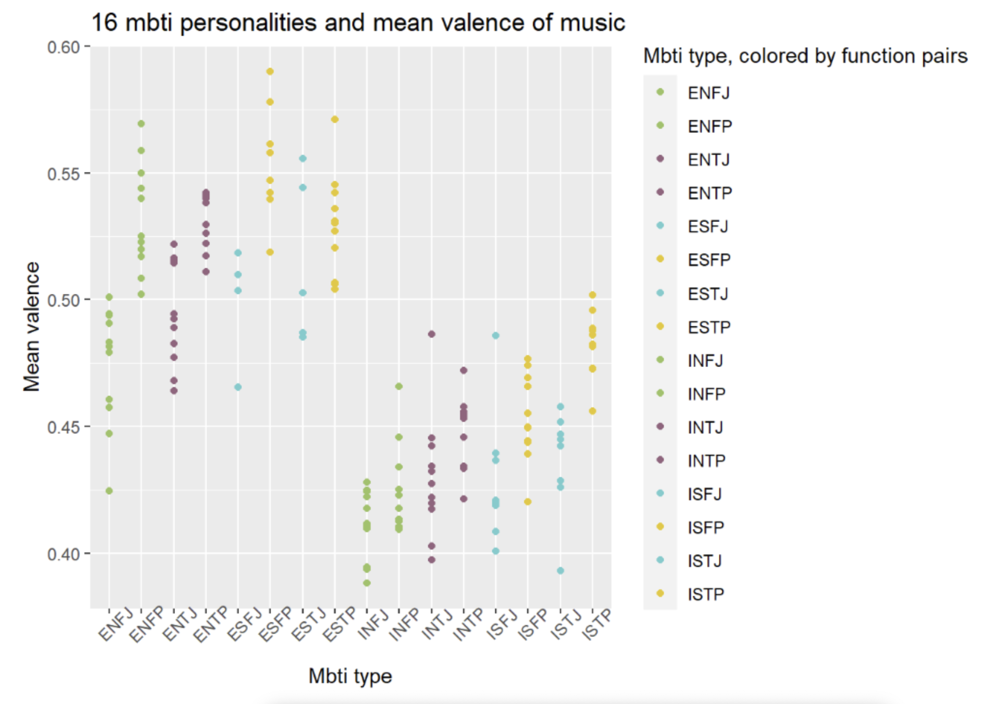

# info201mbti
Group members: Amelia Li, Tianhui Zhou, Jiawei guo, Meiyao Li

This project explores a broad correlation and pattern between mbti personality types and their music tastes, measured with the mean of music metadata. 

Our audience are teenagers and young adults who are familiar with the MBTI personality classification. We hope that our result can help people explore themselves better, discovering new communities and new worlds of music that others who have some resemblance to their view of the world enjoy, or celebrate the idiosyncrasies of each individual’s music tastes. This self-discovery opens new ways of looking at the music one listens to to help identify a new sort of identity. There is a lot to learn from reading our report about the relations between MBTI type (the way they view and interact with the world) and music taste, as we found there are indeed different preferences for music for different MBTI types.

Using metadata about songs on Spotify, we took a multidimensional approach to classifying music and therefore in a way classifying the people who enjoy listening to that music. In a way, understanding music taste is understanding yet another crucial dimension to a person. The role that music plays for an individual and what the story of the music they listen to is inherently shaped by who they are, their own stories, their preferences, and what they feel connected to.

This figure suggests a clear visible trend of extroverted types having a higher mean valence, the musical positiveness, of songs than introverted types. 
